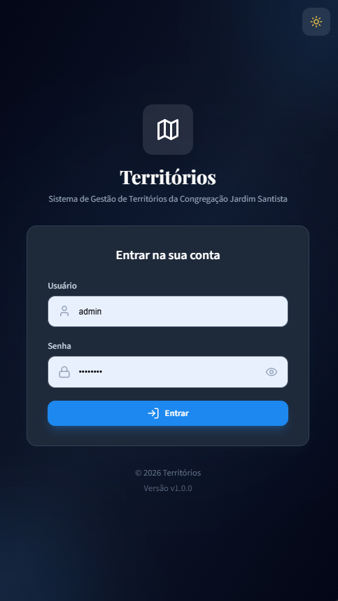
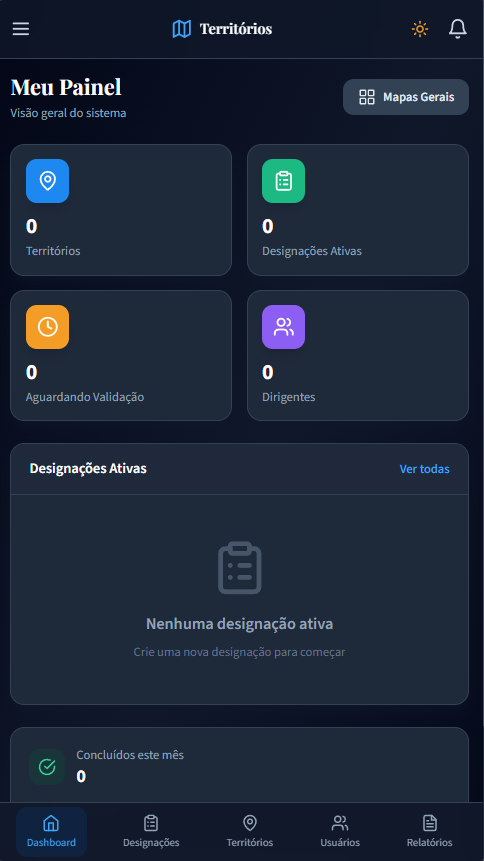
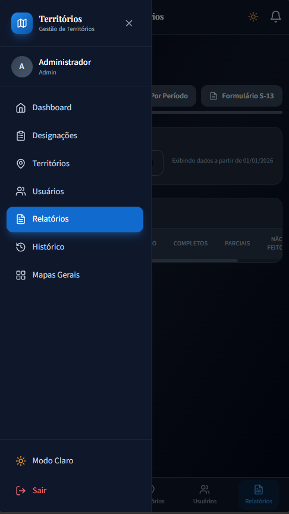
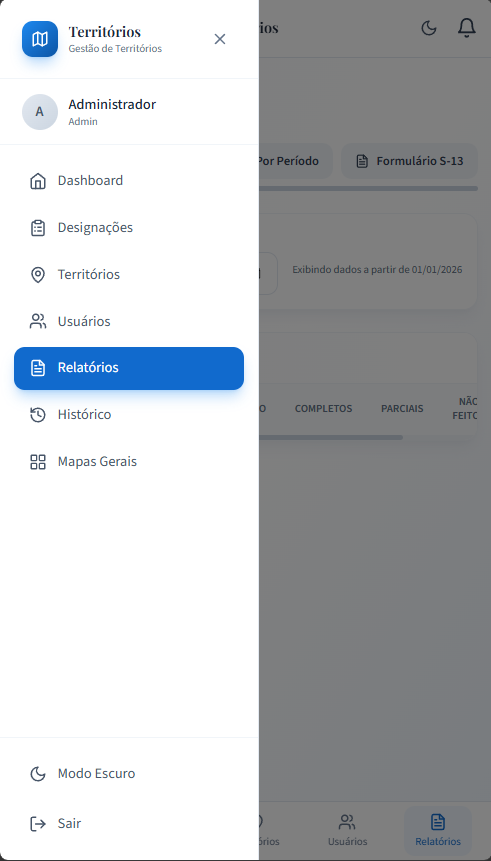

# Territórios

Territories management platform for congregation workflows, built with React + Vite on the frontend and Node.js + Express + PostgreSQL on the backend. The project covers the full operational flow: login, dashboards, assignments, territory tracking, reports, push notifications, and PWA support.

## Highlights

- Authentication with role-based access control
- Territory registration and map management
- Assignment lifecycle: pending, in progress, returned, completed, and cancelled
- Administrative dashboards and operational reports
- S-13 report generation
- Web Push notifications
- Responsive UI with light and dark themes
- PWA-ready client experience

## Screenshots

### Login screen



### Dashboard



### Mobile navigation



### Mobile menu in light theme



## Tech Stack

### Client

- React 18
- Vite 5
- Tailwind CSS
- React Router
- Axios
- jsPDF + jspdf-autotable
- Vitest + Testing Library

### Server

- Node.js (ESM)
- Express
- PostgreSQL (`pg`)
- JWT auth (`jsonwebtoken`)
- Password hashing (`bcryptjs`)
- Jest + Supertest
- Web Push (`web-push`)

## Project Structure

```text
.
├── client/                 # React app (Vite)
├── server/                 # Express API
├── img/                    # README screenshots
├── docker-compose.yaml     # Full stack local containers
├── GUIA_CONSTRUCAO.md      # Long-form build guide
└── formulario.html         # Static S-13 helper/form file
```

## Requirements

- Node.js 18+
- npm 9+
- PostgreSQL 17+ or compatible
- Docker + Docker Compose optional, for local containerized run

## Environment Variables

### Server

The server reads environment variables through `dotenv`.

Required in most setups:

- `DB_HOST`
- `DB_PORT`
- `DB_NAME`
- `DB_USER`
- `DB_PASSWORD`
- `JWT_SECRET`
- `JWT_EXPIRES_IN`
- `VAPID_PUBLIC_KEY`
- `VAPID_PRIVATE_KEY`

Optional:

- `PORT` (default: `3001`)
- `DATABASE_URL` (if set, used instead of discrete DB vars)
- `DB_SSL=true` (or `PGSSLMODE=require` / `SSLMODE=require`)
- `VAPID_SUBJECT`
- `DEFAULT_ADMIN_NAME`
- `DEFAULT_ADMIN_USERNAME`
- `DEFAULT_ADMIN_PASSWORD`

### Client

Optional:

- `VITE_API_BASE_URL`

Behavior:

- If `VITE_API_BASE_URL` is set, the client uses it.
- Otherwise the client uses `/api` and relies on the Vite proxy in development or Nginx proxy in Docker.

## Quick Start

### 1. Install dependencies

```bash
cd server && npm install
cd ../client && npm install
```

### 2. Configure the database

Make sure PostgreSQL is running and reachable with the server environment variables above.

### 3. Run migrations

```bash
cd server
npm run migrate
```

### 4. Start the backend

```bash
cd server
npm run dev
```

The API runs at `http://localhost:3001`.

### 5. Start the frontend

```bash
cd client
npm run dev
```

The client runs at `http://localhost:5173`.

## Docker Compose

Start the full stack with PostgreSQL included:

```bash
docker compose up --build
```

Services:

- Client: `http://localhost` on port `80`
- Server: `http://localhost:3001`
- Database: `postgres:17` on port `5432`

Stop everything with:

```bash
docker compose down
```

## Testing

### Client

```bash
cd client
npm test
npm run test:watch
```

### Server

```bash
cd server
npm test
npm run test:watch
npm run test:coverage
```

## Build

### Client

```bash
cd client
npm run build
npm run preview
```

### Server

```bash
cd server
npm start
```

## Available Scripts

### client/package.json

- `dev` - Start Vite dev server
- `build` - Production build
- `preview` - Preview built app
- `test` - Run tests once
- `test:watch` - Watch mode tests

### server/package.json

- `start` - Run API with Node
- `dev` - Run API with nodemon
- `migrate` - Run DB migration script
- `seed` - Seed helpers, when available
- `generate-vapid` - Generate push VAPID keys
- `test` - Run Jest suite
- `test:watch` - Run Jest in watch mode
- `test:coverage` - Run Jest with coverage

## API Base Paths

- `/api/auth`
- `/api/users`
- `/api/territories`
- `/api/assignments`
- `/api/reports`
- `/api/maps`
- `/api/push`

## Notes

- The server migration creates the schema and inserts a default admin on first run when no admin exists.
- PostgreSQL date parsing is customized to reduce timezone drift for date-only fields.
- The app is designed to work well on desktop and mobile, with a mobile bottom navigation and adaptive drawers.

## Troubleshooting

- 401 loop on the client: the token may be invalid or expired. The client clears auth data and redirects to login on HTTP 401.
- Date shift issues: PostgreSQL DATE values are parsed as strings to avoid timezone drift.
- Docker startup issues: confirm that the `db` service is healthy and that the server is using `DB_HOST=db` in compose.

## Additional Documentation

- See [GUIA_CONSTRUCAO.md](./GUIA_CONSTRUCAO.md) for the full implementation walkthrough.

## Contributing

If you are interested in helping out, please, don't hesitate to reach out!
